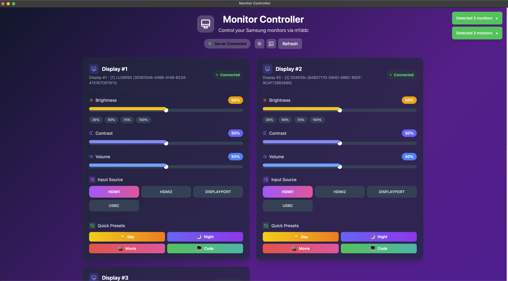
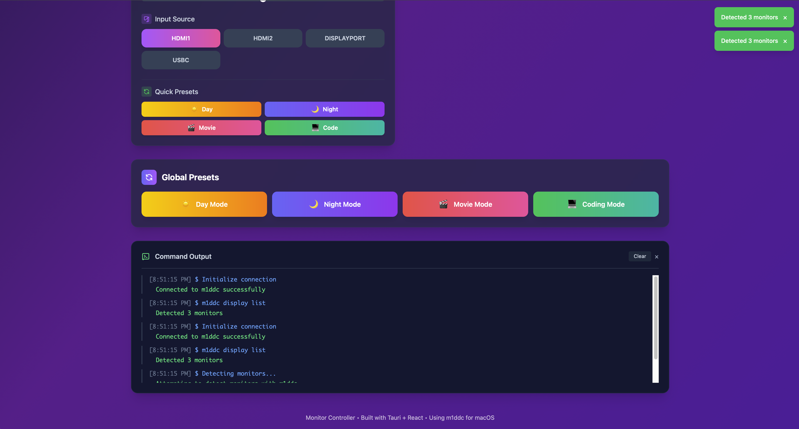

# Monitor Controller

Monitor Controller is a desktop application built with [Tauri](https://tauri.app/), [React](https://reactjs.org/), [TypeScript](https://www.typescriptlang.org/), and [Vite](https://vitejs.dev/).

## Project Structure

-   `monitor-ui/`: Contains the React frontend application.
    -   `src/`: Frontend source code (React components, styles, etc.)
    -   `public/`: Static assets for the frontend.
    -   `vite.config.ts`: Vite configuration.
    -   `package.json`: Frontend dependencies and scripts.
-   `src-tauri/`: Contains the Tauri Rust backend.
    -   `src/`: Rust source code for the backend logic.
    -   `tauri.conf.json`: Tauri application configuration.
    -   `Cargo.toml`: Rust dependencies.
    -   `icons/`: Application icons.
-   `build_and_run.sh`: A utility script to build and run the application.
-   `art/`: Contains preview images of the application.

## Application Preview

Here's a glimpse of Monitor Controller:




## Prerequisites

-   [Node.js and npm](https://nodejs.org/) (or yarn)
-   [Rust and Cargo](https://www.rust-lang.org/tools/install)
-   [Tauri development prerequisites](https://tauri.app/v1/guides/getting-started/prerequisites)

## Development

To run the application in development mode:

1.  **Navigate to the frontend directory and install dependencies:**
    ```bash
    cd monitor-ui
    npm install # or yarn install
    ```

2.  **Navigate to the project root and run the Tauri development server:**
    ```bash
    cd ..
    cargo tauri dev
    ```

## Building the Application

To build the application for production:

1.  **Ensure frontend dependencies are installed:**
    ```bash
    cd monitor-ui
    npm install # or yarn install
    cd ..
    ```

2.  **Build the application using Tauri:**
    ```bash
    cargo tauri build
    ```
    The executable will be located in `src-tauri/target/release/` (for Linux/Windows) or `src-tauri/target/release/bundle/macos/` (for macOS). For macOS, a `.dmg` file will be created containing the `.app` bundle.

Alternatively, you can use the provided script:

```bash
./build_and_run.sh
```

This script typically handles both building the frontend and the Tauri application, and then runs it. Check the script's content for specific steps if needed.

## Installation and Usage (macOS)

After building the application, you will find a `.dmg` file in `src-tauri/target/release/bundle/macos/`.

1.  Open the `.dmg` file.
2.  Drag the `Monitor Controller.app` (or similar named `.app` file) to your `Applications` folder.
3.  You can now launch the application from your `Applications` folder or Launchpad.

## Installation and Usage (Linux/Windows)

After building, the executable will be in `src-tauri/target/release/`. You can run this executable directly. For Windows, an installer might also be generated in `src-tauri/target/release/bundle/msi/`.

## About This README

This README file was generated by an AI assistant.
